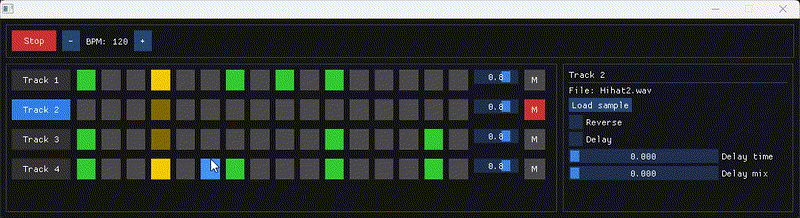
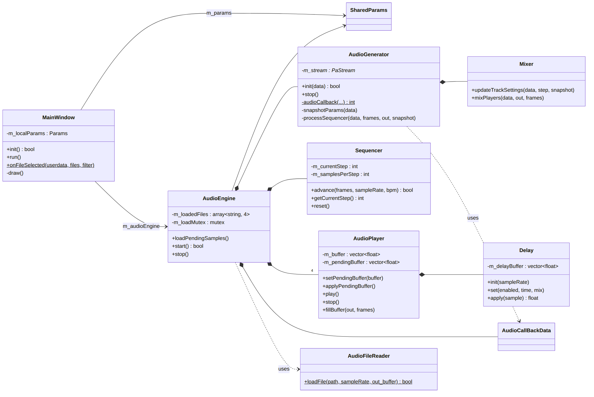

# Drum Machine

A 16-step drum machine written in **C++20**, with a real-time audio engine and a desktop UI.



> School project made at **HE2B-ESI** (Brussels) as part of my bachelor's degree in application development.

## Features

- **4 tracks × 16 steps** grid sequencer: click a step to turn it on or off
- **Load any WAV file** on each track (converted to mono, 44.1 kHz, when it is loaded)
- **Tempo** from 40 to 240 BPM, with a playhead that shows the current step
- **Per-track controls**: volume, mute, reverse playback, delay (echo) with time and mix settings
- **Preferences**: the sample of each track is saved and loaded again at the next start

## Tech stack

| Part | Technology |
|---|---|
| Language | C++20 |
| Window, input, file dialog, WAV loading | [SDL3](https://github.com/libsdl-org/SDL) |
| User interface | [Dear ImGui](https://github.com/ocornut/imgui) |
| Audio output | [PortAudio](https://github.com/PortAudio/portaudio) |
| Build | CMake (dependencies downloaded with `FetchContent`) |

## How it works

The app uses **two threads** that must never block each other:

- The **UI thread** (`MainWindow`) draws the interface 60 times per second.
- The **audio thread** (`AudioGenerator`) is called by PortAudio every 256 samples (about 6 ms) to compute the next audio buffer. If it is late, the user hears a click.

They share one object, `SharedParams`, protected by a mutex. Some design choices:

- **Snapshots**: each thread copies the shared state, then works on its own copy. The mutex is only locked for this copy.
- **The audio thread never waits**: it uses `try_lock`. If the UI holds the mutex, the audio thread keeps its last copy for this buffer.
- **Safe sample loading**: a WAV file is read and converted outside the audio thread. The audio thread then takes the new sample with a simple `std::vector::swap`, so it never allocates or frees the sample memory.
- **No tempo drift**: the `Sequencer` counts audio samples (not clock time) to know when the next step starts.

```
src/
├── main.cpp
├── audio/    AudioEngine, AudioGenerator, Sequencer, Mixer, AudioPlayer, Delay, AudioFileReader
├── shared/   Preferences
└── view/     MainWindow
include/      headers, same structure
```

Class diagrams: [docs/class-diagram.md](docs/class-diagram.md)



## Build and run

### Requirements

- CMake 3.24 or newer
- A C++20 compiler (GCC 11+, Clang 14+ or MSVC 2022)
- Git and an internet connection for the first build: CMake downloads SDL3, Dear ImGui and PortAudio
- **Linux only**: the development packages for audio and windowing, for example on Ubuntu:
  ```bash
  sudo apt install libasound2-dev libx11-dev libxext-dev libxrandr-dev libxcursor-dev libxi-dev libxss-dev libxkbcommon-dev libwayland-dev
  ```

### Command line

```bash
git clone https://github.com/ian-grande-dev/esi-drum-machine-cpp.git
cd esi-drum-machine-cpp/drum-machine-project
cmake -S . -B build -DCMAKE_BUILD_TYPE=Release
cmake --build build
```

Then run `build/drum-machine` (or `build\drum-machine.exe` on Windows).

The first build takes a few minutes, because SDL3 and PortAudio are compiled from source.

### CLion

Open the `drum-machine-project` folder as a project, then run the `drum-machine` target.

### Usage

1. Select a track on the left, then click **Load sample** and choose a WAV file.
2. Click the steps of the grid to build a pattern.
3. Press **Play** and change the BPM, the volume or the effects while it plays.

No samples are included in this repository: any short WAV file (kick, snare, hi-hat...) works.

## Known limitations

- A step starts at the beginning of an audio buffer, so its timing can be up to about 6 ms late.
- The audio thread copies the shared state, which contains `std::string` fields. This copy can allocate memory, which a professional audio engine avoids.
- The number of tracks and steps is fixed at compile time (`include/shared/Constants.h`).

## Third-party libraries

The libraries are not included in this repository. CMake downloads them from their official repositories:

- SDL3 — [zlib license](https://github.com/libsdl-org/SDL/blob/main/LICENSE.txt)
- Dear ImGui — [MIT license](https://github.com/ocornut/imgui/blob/master/LICENSE.txt)
- PortAudio — [MIT-style license](https://github.com/PortAudio/portaudio/blob/master/LICENSE.txt)

## Author

**Ian** - Student in Application Development at HE2B-ESI, Brussels

[LinkedIn](https://www.linkedin.com/in/ian-grande/) · [GitHub](https://github.com/ian-grande-dev) · [Email](mailto:ian.grande.pro@gmail.com)
