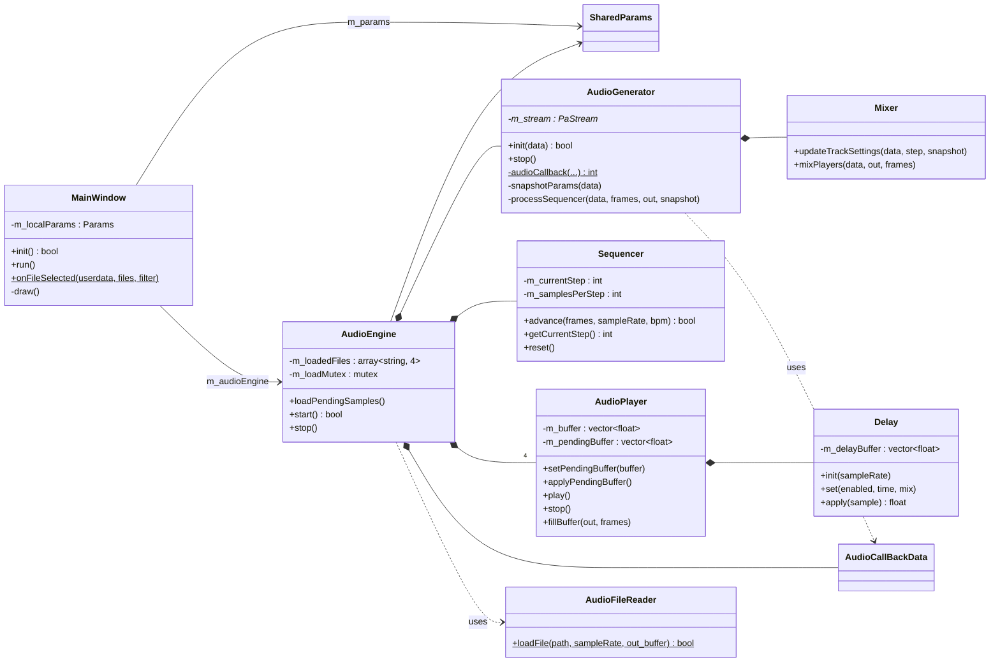
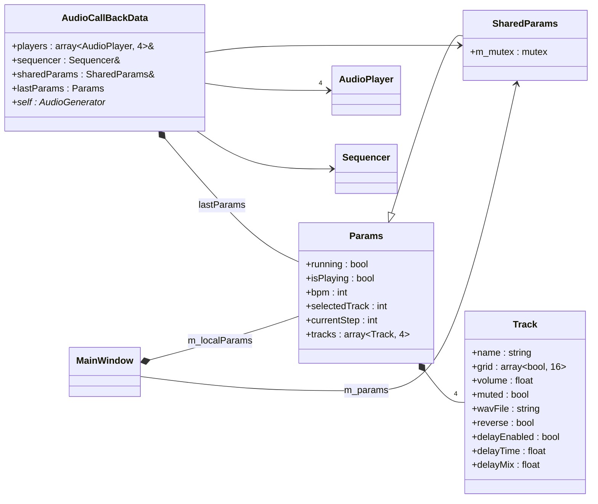

# Class diagrams

## 1. Overview

The main classes and how they are linked. `AudioEngine` owns all the audio parts. `MainWindow` (UI thread) and the audio callback (PortAudio thread) share data through `SharedParams`.

## 2. Shared data

The data shared between the UI thread and the audio thread. Each thread works on its own copy of `Params` and locks `SharedParams::m_mutex` only to copy it.

